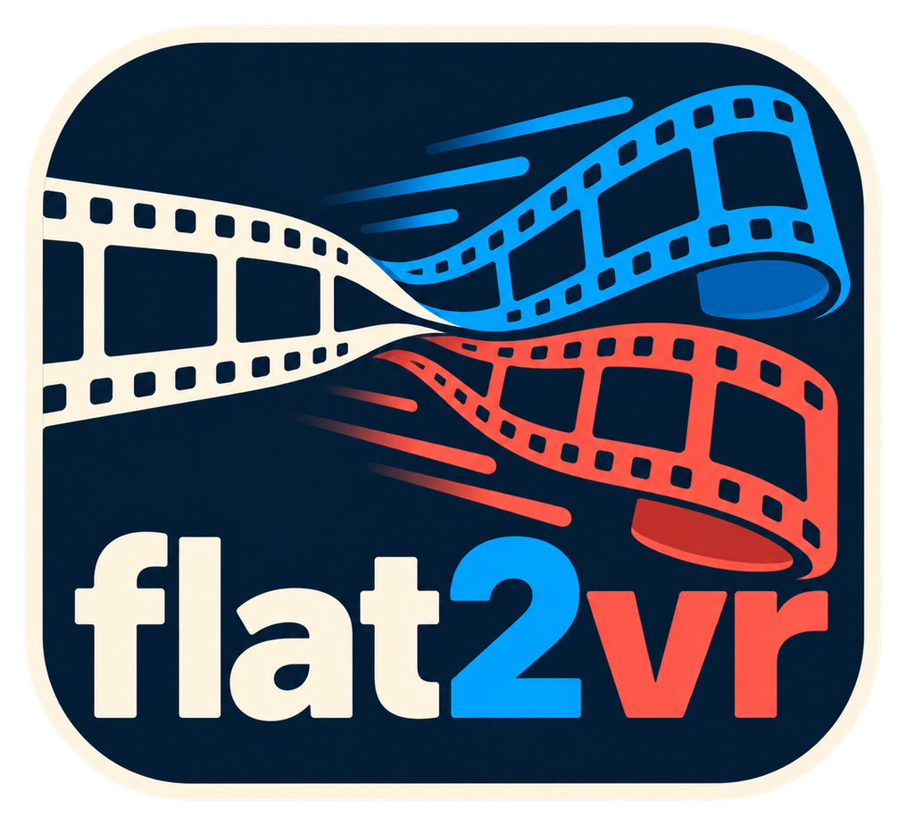
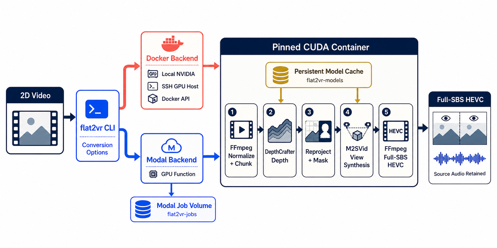

<div align="center">
  

  **🎞️ Turn flat video into headset-ready stereo depth 🥽**
</div>

flat2vr is a Python CLI for video creators and VR viewers who want to turn
ordinary 2D footage into stereoscopic Full Side-by-Side video for headsets such
as Meta Quest 3. Point it at a video and run the conversion on an NVIDIA Docker
host or Modal; it returns an HEVC `.mp4` with the source audio retained.

The Python distribution is named `flat2vr-cli`; it installs the `flat2vr`
command and `flat2vr` import package.

The lightweight client stays local. CUDA, FFmpeg, DepthCrafter depth estimation,
and M2SVid view synthesis run inside the same pinned GPU container on either
backend.

## Install

flat2vr requires Python 3.11 or newer and uses
[uv](https://docs.astral.sh/uv/) for its local environment.

```bash
git clone https://github.com/tsilva/flat2vr-cli.git
cd flat2vr-cli
uv sync
```

Run `uv run flat2vr --help` to inspect the CLI.

## Commands

```bash
# Check a local or API-addressed NVIDIA Docker host, then convert a video.
uv run flat2vr doctor --backend docker
uv run flat2vr convert input.mp4

# Convert on a remote Docker host over SSH.
uv run flat2vr convert input.mp4 -o output_Full_SBS.mp4 \
  --docker-ssh gpu.example.com --docker-sudo

# Build the pinned GPU image explicitly.
uv run flat2vr build
```

To use Modal instead of Docker:

```bash
uv sync --extra modal
uv run modal setup
uv run flat2vr modal deploy
uv run flat2vr doctor --backend modal
uv run flat2vr convert input.mp4 --backend modal
```

Tune the conversion or run the test suite:

```bash
uv run flat2vr convert input.mp4 -o output_Full_SBS.mp4 \
  --disparity 0.05 --depth-steps 5 --output-height 1024 --quality 19

uv run python -m unittest discover -s tests -v
```

## Notes

- The default output is `<input>_Full_SBS.mp4`. Select SBS/LR or 3D SBS mode
  manually if your player does not infer the layout from the filename.
- At the default output height, a 16:9 source produces an approximately
  3584×1024 frame containing two full-resolution eye views.
- `--encoder auto` prefers NVENC and retries with CPU `libx265` if NVENC fails.
- The first conversion populates the persistent `flat2vr-models` cache with
  roughly 13 GB of model data. Later jobs reuse it.
- Docker can run locally, through a Docker API endpoint, or over SSH. Modal uses
  the same pinned container plus `flat2vr-models` and `flat2vr-jobs` volumes.
- Successful Modal jobs remove their uploaded input and generated output after
  download. Failed job files are retained for diagnosis.
- The result provides binocular depth, not six-degree-of-freedom geometry. You
  can watch the 3D image, but you cannot move around its objects.
- Source revisions, Python environments, model revisions, and model hashes are
  pinned for reproducible conversions.

## Architecture


